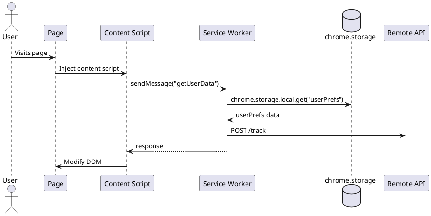

# GitHub Copilot Instructions for Chrome Extension Reverse Engineering

## Project Context

This workspace is for reverse engineering Chrome Extensions (MV3) to produce structured, evidence-based behavioral analysis. All work must be local, schema-compliant, and grounded in verifiable code evidence.

---

## Quick Start

**To begin analysis, use this prompt:**

```
Begin Chrome extension reverse engineering analysis. Model: [YOUR_MODEL_NAME]. Start with run setup and proceed through all steps.
```

---

## Core Principles

### Evidence-First Rule
- **Every claim** in final JSON must include at least one evidence span with:
  - Original file path (never beautified paths in evidence)
  - Line range (`start` and `end`) from original file
  - Optional: stable AST node ID
- If something is unknown, explicitly set `"unknown"` and document the gap in `analysis_notes.md`
- Never speculate or infer without code evidence

### Local-Only Execution
- Install tools locally if needed (npm packages, beautifiers, parsers)
- Do NOT call external services or APIs
- Work entirely within the current workspace

### MV3 Specifics
- Prefer `service_worker` analysis over legacy background pages
- Focus on Manifest V3 patterns (declarativeNetRequest, service workers, etc.)

---

## File Handling Rules

### Beautified Files
- Any filename containing `"beautified"` is a derived artifact, NOT an original source
- **Always cite original file paths** in evidence, never beautified paths
- Maintain mapping in `beautify_map.json`: `[{original, beautified, status}]`
- You may read beautified content for analysis, but citations must reference original files

### Chunking for Large Files
- **Chunk size**: 2000 lines per chunk (or 5000 if specified)
- Files ≤ chunk size: treat as `"whole-file"` chunk
- Files > chunk size: split into contiguous chunks `[1-2000]`, `[2001-4000]`, etc.
- **Maintain function integrity**: avoid splitting functions when possible
- If a single function > chunk size: subdivide within function and use `same_function_group` field

### Chunk Identification
```json
{
  "chunk": {
    "id": "chunk-1/10",           // "chunk-k/N" or "whole-file"
    "start_line": 1,               // 1-indexed
    "end_line": 2000,
    "same_function_group": null    // or stable identifier for multi-chunk functions
  }
}
```

---

## Logging Rules (Strict Append-Only)

### Critical Constraint
- **ONLY append** to `analysis_notes.md` and `outline.jsonl`
- **NEVER delete or edit** existing lines in these files
- Use `cat <<'EOF' >> <file>` syntax for appending in shell commands
- This ensures complete audit trail of all findings

---

## outline.jsonl Format

When working with `outline.jsonl` files, follow these rules:

### File Structure
- Each line is a separate JSON object (JSONL format - newline-delimited JSON)
- Each object represents one chunk of a source code file analysis
- DO NOT create a JSON array with brackets - each entry is a separate line

### Required Fields
1. **file**: Source file path being analyzed
2. **beautified**: Path to beautified version (if applicable)
3. **chunk**: Object with:
   - `id`: Format "chunk-X/Y" (e.g., "chunk-1/46")
   - `start_line`: Integer, starting line number
   - `end_line`: Integer, ending line number
   - `same_function_group`: String or null for multi-chunk functions

4. **findings**: Object containing arrays for:
   - `chrome_apis`: Chrome extension APIs used
   - `event_listeners`: Event listeners found
   - `messages`: Message passing patterns
   - `storage`: Storage operations
   - `endpoints`: API endpoints/URLs
   - `dom`: DOM manipulations
   - `dynamic_code`: eval, Function(), etc.
   - `wasm`: WebAssembly usage
   - `obfuscation_hints`: Array of obfuscation indicators
   - `risks`: Array of risk objects with type, severity, description

5. **evidence**: Array of objects with file, start, end, ast_id
6. **notes**: String with human-readable summary

### Obfuscation Hints Valid Values
- webpack_modules
- minified_vars
- private_fields
- class_declarations
- function_chains
- generated_apis
- object_property_chaining
- typescript_generated_enums
- api_client_patterns
- api_middleware
- fetch_abstractions
- error_handling_patterns

### Example Entry
```jsonl
{"file":"src/app.js","beautified":"src/app.beautified.js","chunk":{"id":"chunk-1/10","start_line":1,"end_line":100,"same_function_group":null},"findings":{"chrome_apis":["chrome.storage.local"],"event_listeners":[],"messages":[],"storage":["localStorage"],"endpoints":[],"dom":[],"dynamic_code":[],"wasm":[],"obfuscation_hints":["minified_vars"],"risks":[]},"evidence":[{"file":"src/app.js","start":1,"end":100,"ast_id":null}],"notes":"Initial setup and configuration."}
```

----

## Chrome Extension Analysis Targets

### What to Extract (with evidence)

#### Chrome API Calls
- `chrome.tabs.*`, `chrome.scripting.*`, `chrome.storage.*`
- `chrome.cookies.*`, `chrome.declarativeNetRequest.*`
- `chrome.webRequest.*`, `chrome.identity.*`
- `chrome.contextMenus.*`, `chrome.runtime.*`, `chrome.alarms.*`
- `chrome.permissions.*`, etc.

#### Event Listeners
- `runtime.onMessage.addListener`
- `tabs.onUpdated.addListener`
- `webRequest.onBeforeRequest.addListener`
- `alarms.onAlarm.addListener`
- DOM event listeners (`addEventListener`)

#### Messaging Patterns
- `runtime.sendMessage`, `tabs.sendMessage`
- `runtime.connect`, `onConnect`, `onMessage`, `onMessageExternal`
- Capture literal payload keys when possible
- Infer direction: `content->background`, `background->content`, `ui->background`

#### Storage Operations
- `chrome.storage.[local|sync|managed]` get/set/remove
- IndexedDB operations
- Cookie operations
- Capture literal keys

#### Network Communications
- `fetch()`, `XMLHttpRequest`, `navigator.sendBeacon()`
- WebSocket connections
- Extract literal URLs, template strings, base hosts/domains

#### Dynamic Code & Obfuscation
- `eval()`, `new Function()`
- `import()` dynamic imports
- `importScripts()`
- `atob()` and other decoders
- String tables, control flow flattening (large switch statements)
- Dead code indicators

#### WebAssembly
- `WebAssembly.instantiate*`, `WebAssembly.Module`, `WebAssembly.Instance`
- `.wasm` file references
- ArrayBuffer sources for WASM

#### DOM Interaction
- `querySelector*`, `getElementById`, etc.
- `addEventListener`, `MutationObserver`
- `innerHTML`, `document.write`, `eval` in HTML context

---

## Output Structure

### Required Deliverables (in OUT_DIR)

1. **`extension_summary.json`** - Main structured output (must validate against schema)
2. **`outline.jsonl`** - Streaming per-chunk findings (append-only)
3. **`analysis_notes.md`** - Human-readable log (append-only)
4. **`permissions_report.json`** - Extracted permissions from manifest
5. **`endpoints.csv`** - All discovered endpoints
6. **`messages.csv`** - All messaging channels
7. **`storage_keys.csv`** - All storage keys
8. **`flows.puml`** - PlantUML diagram of component flows
9. **`beautify_map.json`** - Mapping of original to beautified files
10. **`run_info.json`** - Run metadata (model, run ID, timestamp)
11. **`scan_log.txt`** - Summary log (tools used, counts, validation status)
12. **`schema.chrome_extension_behavior.json`** - JSON schema (copy verbatim)

---

## Analysis Steps (Complete Workflow)

### Step 0: Beautify All JS

**Purpose**: Create readable versions of all JavaScript for analysis while preserving original file references.

1. Install beautifier locally:
   ```bash
   npm init -y
   npm i --save-dev js-beautify
   ```

2. Enumerate all `.js` and `.mjs` files in the workspace, **excluding**:
   - `node_modules/`, `vendor/`, `build/`, `dist/`, `coverage/`
   - Any path under current `OUT_DIR`
   - Any path already containing `"beautified"`

3. For each original file `foo.js`:
   - Create `foo.beautified.js` via `npx js-beautify --indent-size 2 --preserve-newlines foo.js -o foo.beautified.js`
   - Do the same for `.mjs` files

4. Record mapping in `OUT_DIR/beautify_map.json`:
   ```json
   [
     {"original": "serviceWorker.js", "beautified": "serviceWorker.beautified.js", "status": "ok"},
     {"original": "content.js", "beautified": "content.beautified.js", "status": "error: parse failed"}
   ]
   ```

5. **Remember**: You may read beautified files for parsing, but **always cite evidence using original file paths and original line ranges**.

---

### Step 1: Inventory

**Purpose**: Extract basic metadata and permissions from manifest.json.

1. Parse `manifest.json` and extract:
   - `name`, `version`, `manifest_version`
   - `background.service_worker` (or `background.scripts` for MV2)
   - `content_scripts` (files, matches, run_at)
   - `web_accessible_resources`
   - `permissions`, `host_permissions`, `optional_permissions`
   - `externally_connectable`
   - `declarativeNetRequest` rules (if present)

2. Write `OUT_DIR/permissions_report.json`:
   ```json
   {
     "api_permissions": ["storage", "tabs", "scripting"],
     "host_permissions": ["https://*/*"],
     "optional_permissions": ["cookies"],
     "evidence": [{"file": "manifest.json", "start": 10, "end": 15}]
   }
   ```

3. Start `OUT_DIR/analysis_notes.md`:
   ```markdown
   # Run 001 (GPT-4o)
   
   ## Manifest
   
   - Name: Example Extension
   - Version: 1.2.3
   - Manifest Version: 3
   - Service Worker: serviceWorker.js
   - Content Scripts: content.js (matches: <all_urls>)
   - Permissions: storage, tabs, scripting
   - Host Permissions: https://*/*
   
   Evidence: manifest.json:1-25
   ```

---

### Step 2: Parsing/AST Scan with Chunking

**Purpose**: Extract all Chrome API calls, event listeners, messaging, storage, network, dynamic code, etc. from all source files.

#### 2.1 Install Parsers

```bash
npm i espree @typescript-eslint/typescript-estree acorn acorn-walk
```

#### 2.2 Identify Source Files

Build a list of all JavaScript sources relevant to the extension:
- Service worker from manifest
- Content scripts from manifest
- Any scripts loaded via `chrome.scripting.executeScript`
- Any scripts loaded via `importScripts()`
- UI files (popup, options, sidepanel)
- Any dynamically imported scripts

**Exclude** any path containing `"beautified"` from being counted as an original.

#### 2.3 Chunk Each File

For each source file:

**If file ≤ 2000 lines** (or configured chunk size):
- Treat as single chunk
- Set `chunk.id = "whole-file"`
- Set `start_line = 1`, `end_line = <last line>`

**If file > 2000 lines**:
- Split into contiguous 2000-line chunks: `[1-2000]`, `[2001-4000]`, etc.
- Try to keep function bodies intact
- If a single function exceeds 2000 lines, subdivide it and set `same_function_group` to a stable identifier (function name or hash)

#### 2.4 Parse and Extract

For each chunk:

1. **Build AST** using espree/acorn (tolerant parsing)
   - If full AST fails, try logical subranges
   - If AST completely fails, fall back to regex scanning
   - Note any fallback in `analysis_notes.md`

2. **Extract** (with evidence: original file path + line range + optional ast_id):
   - **Chrome API calls**: `chrome.tabs.query`, `chrome.storage.local.get`, etc.
   - **Event listeners**: `runtime.onMessage.addListener`, `tabs.onUpdated.addListener`, etc.
   - **Messaging**: `runtime.sendMessage`, `tabs.sendMessage`, `runtime.connect`, capture payload literal keys
   - **Storage**: `chrome.storage.[local|sync|managed]` get/set/remove, capture literal keys
   - **Network**: `fetch()`, `XMLHttpRequest`, `navigator.sendBeacon()`, WebSocket URLs (literals and template strings)
   - **DOM**: `querySelector*`, `addEventListener`, `MutationObserver`, `innerHTML`, `document.write`
   - **Dynamic code**: `eval()`, `new Function()`, `import()`, `importScripts()`, `atob()`, decoders
   - **WebAssembly**: `WebAssembly.instantiate*`, `.wasm` references, ArrayBuffer sources
   - **Obfuscation hints**: string tables, switch-based flattening, dead code, minified vars, webpack patterns

3. **Stream findings immediately** after each chunk:

   **Append to `OUT_DIR/outline.jsonl`** (one JSON object per line):
   ```json
   {"file":"serviceWorker.js","beautified":"serviceWorker.beautified.js","chunk":{"id":"chunk-1/3","start_line":1,"end_line":2000,"same_function_group":null},"findings":{"chrome_apis":["chrome.storage.local.get","chrome.tabs.query"],"event_listeners":["runtime.onMessage.addListener"],"messages":[{"name":"getUserData","direction":"content->background","payload_keys":["userId"]}],"storage":[{"key":"userPrefs","type":"local","op":"get"}],"endpoints":[{"url":"https://api.example.com/track","method":"POST"}],"dom":[],"dynamic_code":[],"wasm":[],"obfuscation_hints":["minified_vars"],"risks":[{"type":"tracking","severity":"medium","description":"Sends user data to third-party"}]},"evidence":[{"file":"serviceWorker.js","start":45,"end":67,"ast_id":"FunctionDeclaration_handleMessage"}],"notes":"Message handler that queries tabs and accesses storage."}
   ```

   **Append to `OUT_DIR/analysis_notes.md`**:
   ```markdown
   ## serviceWorker.js [chunk 1/3, lines 1-2000]
   
   ### Summary
   Message handler that queries tabs and accesses storage. Sends tracking data to third-party.
   
   ### Chrome APIs
   - chrome.storage.local.get (line 45)
   - chrome.tabs.query (line 123)
   
   ### Event Listeners
   - runtime.onMessage.addListener (line 67)
   
   ### Messaging
   - Channel: "getUserData", direction: content->background, keys: ["userId"]
   
   ### Storage
   - Key: "userPrefs", type: local, op: get (line 234)
   
   ### Endpoints
   - POST https://api.example.com/track (line 456)
   
   ### DOM/Sinks
   - None in this chunk
   
   ### Dynamic Code/Obfuscation
   - Minified variable names detected
   
   ### Risks
   - Tracking: sends user data to third-party without clear consent
   
   ### Evidence
   - serviceWorker.js:45-67
   - serviceWorker.js:123-150
   ```

#### 2.5 Continue for All Chunks

Repeat 2.4 for every chunk of every source file. Stream output as you go.

---

### Step 3: Intermediate Tables

**Purpose**: Create CSV tables for easy querying and cross-referencing during analysis.

**Do this concurrently with Step 2** - as you discover items, immediately append rows to these files:

#### `OUT_DIR/endpoints.csv`
```csv
url,method,file,line_start,line_end
https://api.example.com/track,POST,serviceWorker.js,456,460
https://analytics.example.com/log,GET,content.js,89,92
```

#### `OUT_DIR/messages.csv`
```csv
channel_name,direction,payload_keys,file,line_start,line_end
getUserData,content->background,"userId|timestamp",content.js,45,50
setUserData,background->content,"userData",serviceWorker.js,234,240
```

#### `OUT_DIR/storage_keys.csv`
```csv
key,type,purpose,file,line_start,line_end
userPrefs,local,Store user preferences,serviceWorker.js,123,125
authToken,local,Authentication token,popup.js,67,70
```

**Also append** newly discovered items to `analysis_notes.md` under "Discovered items" sections.

---

### Step 4: Components and Flows

**Purpose**: Identify architectural components and their communication patterns.

#### 4.1 Identify Components

Categorize all source files into:

1. **Background**: Service worker or background scripts
2. **Content Scripts**: Scripts injected into pages via manifest
3. **Injected Scripts**: Dynamically injected via `chrome.scripting.executeScript`, `importScripts`, or dynamic `import()`
4. **UI**: Popup, options page, side panel, DevTools panels
5. **Page**: Scripts in web_accessible_resources loaded by pages
6. **Remote**: External domains/services (per domain)

For each component, list:
- Files
- Chrome APIs used
- Event listeners registered
- Evidence

#### 4.2 Generate Flow Diagram

Create `OUT_DIR/flows.puml` (PlantUML format):



Include:
- Page ↔ Content communication
- Content ↔ Background messaging
- Background ↔ Remote network calls
- Storage interactions (read/write)
- DNR/webRequest annotations (if applicable)

#### 4.3 Log Summary

Append to `analysis_notes.md`:
```markdown
## Components

### Background (Service Worker)
- Files: serviceWorker.js
- APIs: chrome.storage.local, chrome.tabs, chrome.runtime
- Listeners: runtime.onMessage, alarms.onAlarm
- Evidence: serviceWorker.js:1-5000

### Content Scripts
- Files: content.js
- APIs: chrome.runtime
- Listeners: runtime.onMessage
- Evidence: manifest.json:15-20, content.js:1-300

### Flows
- Content → Background: "getUserData" message
- Background → Remote: POST https://api.example.com/track
- Background → Storage: write "userPrefs"
```

---

### Step 5: Core Workflows

**Purpose**: Identify and describe high-level user-facing workflows/features.

#### 5.1 Cluster Related Operations

Group related activities by:
- **Message channels** (e.g., all handlers for "login" message)
- **Endpoint families** (e.g., all calls to `api.example.com`)
- **Storage read/write cycles** (e.g., token storage and retrieval)
- **Timers/alarms** (e.g., periodic sync)
- **UI entry points** (e.g., popup button click)

#### 5.2 Create Workflow Descriptions

For each identified workflow, create:

```json
{
  "name": "User Login Flow",
  "triggers": ["User clicks login button in popup", "Extension installed"],
  "steps": [
    "User enters credentials in popup form",
    "Popup sends 'login' message to service worker",
    "Service worker validates credentials via POST to /auth/login",
    "Service worker stores auth token in chrome.storage.local",
    "Service worker sends 'loginSuccess' message back to popup",
    "Popup displays success message and closes"
  ],
  "apis": [
    "chrome.runtime.sendMessage",
    "chrome.storage.local.set",
    "chrome.tabs.query"
  ],
  "messages": ["login", "loginSuccess"],
  "endpoints": ["https://auth.example.com/login"],
  "storage_keys": ["authToken", "userId"],
  "evidence": [
    {"file": "popup.js", "start": 45, "end": 70},
    {"file": "serviceWorker.js", "start": 234, "end": 289}
  ]
}
```

#### 5.3 Log Workflows

Append to `analysis_notes.md`:
```markdown
## Workflows

### User Login Flow
**Triggers**: User clicks login button, extension installed
**Steps**:
1. User enters credentials in popup
2. Popup sends 'login' message to service worker
3. Service worker validates with POST /auth/login
4. Service worker stores authToken in chrome.storage.local
5. Service worker responds with 'loginSuccess'

**APIs**: chrome.runtime.sendMessage, chrome.storage.local.set
**Messages**: login, loginSuccess
**Endpoints**: https://auth.example.com/login
**Storage**: authToken, userId
**Evidence**: popup.js:45-70, serviceWorker.js:234-289
```

---

### Step 6: Privacy, Security, Compliance

**Purpose**: Assess privacy implications and security risks based on collected evidence.

#### 6.1 Privacy Analysis

Infer from storage keys, payload shapes, selectors, endpoints:

**Data Categories**:
- User credentials (passwords, tokens)
- Browsing history (visited URLs, timestamps)
- PII (emails, names, addresses)
- User preferences/settings
- Analytics/telemetry

**Purposes**:
- Authentication
- Personalization
- Analytics
- Advertising
- Feature functionality

**Minimization**:
- "Collects minimal necessary data" vs. "Collects excessive data for stated purpose"

**Consent**:
- Look for explicit user prompts
- Check for opt-in/opt-out mechanisms
- "No explicit consent mechanism observed" vs. "User must accept terms before use"

**Retention**:
- Check for TTLs, expiration, clear operations
- "Indefinite storage" vs. "Cleared after 30 days"

**Third Parties**:
- Identify all external domains
- Infer purpose (analytics, CDN, API, advertising)
- Include evidence for each

**Policy Compliance**:
- "Potential GDPR concerns: no consent, indefinite retention"
- "May violate Chrome Web Store policy: remote code execution"

#### 6.2 Security/Risk Analysis

For each identified risk, create:

```json
{
  "type": "tracking",
  "severity": "medium",
  "justification": "Extension sends user browsing history to third-party analytics service without explicit user consent. Includes URLs and timestamps.",
  "evidence": [
    {"file": "serviceWorker.js", "start": 456, "end": 478}
  ]
}
```

**Risk types**:
- `tracking`: Surveillance, behavioral tracking
- `fingerprinting`: Browser/device fingerprinting
- `pii_exfiltration`: Personal data sent externally
- `excessive_permissions`: More permissions than needed
- `remote_code`: Dynamic code loading from external sources
- `insecure_storage`: Sensitive data in localStorage/sync
- `policy_violation`: Violates platform policies

**Severity**:
- `low`: Minor issue, minimal user impact
- `medium`: Significant privacy/security concern
- `high`: Critical issue, immediate user harm potential

#### 6.3 Log Privacy & Risks

Append to `analysis_notes.md`:
```markdown
## Privacy Analysis

### Data Categories
- Browsing history (visited URLs, timestamps)
- User credentials (auth tokens)
- Analytics data (clicks, page views)

### Purposes
- Authentication
- Analytics/tracking
- Feature personalization

### Minimization
Collects more data than necessary. Browsing history collection not disclosed.

### Consent
No explicit consent mechanism observed. User not informed of data collection.

### Retention
Indefinite storage in chrome.storage.local. No cleanup observed.

### Third Parties
- analytics.example.com: Usage tracking (Evidence: serviceWorker.js:456-478)
- cdn.example.com: Asset loading (Evidence: content.js:89-92)

### Policy Compliance
Potential GDPR concerns: lacks consent mechanism and data retention policy.
May violate Chrome Web Store Developer Program Policies regarding user data disclosure.

## Risks

### Risk: Tracking
**Severity**: Medium
**Justification**: Sends browsing history to analytics.example.com without user consent
**Evidence**: serviceWorker.js:456-478

### Risk: Insecure Storage
**Severity**: Low
**Justification**: Auth tokens stored in chrome.storage.sync without encryption
**Evidence**: serviceWorker.js:234-240
```

---

### Step 7: Populate Main JSON and Validate

**Purpose**: Create the final structured output that validates against the schema.

#### 7.1 Write Schema File

Copy the full JSON schema (provided below) verbatim to `OUT_DIR/schema.chrome_extension_behavior.json`.

#### 7.2 Populate extension_summary.json

Aggregate all findings from Steps 1-6 into `OUT_DIR/extension_summary.json`:

- **metadata**: From Step 1 (manifest parsing)
- **permissions**: From Step 1 (manifest parsing)
- **components**: From Step 4 (component identification)
- **network.endpoints**: From Step 2 & 3 (endpoint discovery)
- **messaging.channels**: From Step 2 & 3 (message discovery)
- **storage.keys**: From Step 2 & 3 (storage key discovery)
- **workflows**: From Step 5 (workflow clustering)
- **privacy**: From Step 6 (privacy analysis)
- **risks**: From Step 6 (risk analysis)
- **code_signals**: Aggregate from Step 2 (all API calls, listeners, etc.)

**Critical rules**:
- Every non-empty field must include `evidence` array
- Use original file paths in evidence, never beautified paths
- Do not invent fields beyond the schema
- Validate enum values (risk types, severities, storage types, message directions)

#### 7.3 Validate Against Schema

Use a JSON schema validator (e.g., `ajv`):

```bash
npm i -g ajv-cli
ajv validate -s OUT_DIR/schema.chrome_extension_behavior.json -d OUT_DIR/extension_summary.json
```

If validation fails:
- Review error messages
- Check for missing required fields
- Verify enum values
- Ensure evidence arrays are present

Append validation results to `analysis_notes.md`:
```markdown
## Validation

Schema validation: PASSED
- All required fields present
- Evidence included for all claims
- Enum values valid
```

#### 7.4 Write run_info.json

Create `OUT_DIR/run_info.json`:
```json
{
  "model": "GPT-4o",
  "run_id": 1,
  "out_dir": "./out_001_GPT-4o",
  "timestamp": "2025-11-01T14:32:00Z"
}
```

#### 7.5 Finalize scan_log.txt

Write comprehensive summary to `OUT_DIR/scan_log.txt`:

```
Chrome Extension Reverse Engineering - Scan Log
================================================

Run ID: 001
Model: GPT-4o
Timestamp: 2025-11-01T14:32:00Z
Output Directory: ./out_001_GPT-4o

Tools/Packages Used:
- js-beautify@1.14.0
- espree@9.6.1
- acorn@8.10.0
- @typescript-eslint/typescript-estree@6.7.0

File Counts:
- Original JS files: 47
- Beautified files: 47 (100% success rate)
- Total chunks analyzed: 156
- Service worker: 1 file (serviceWorker.js)
- Content scripts: 2 files (content.js, momoSiteInterop.js)
- UI files: 3 files (popup.html, options.html, site-blocker.html)

Analysis Results:
- Chrome API calls found: 87 unique calls
- Event listeners: 23
- Message channels: 12
- Storage keys: 34
- Network endpoints: 8 unique domains
- Workflows identified: 6
- Privacy risks: 3 medium severity

Beautification:
- Success: 47 files
- Errors: 0 files
- Files excluded: node_modules (127 files), beautified versions

Validation:
- extension_summary.json: PASSED schema validation
- outline.jsonl: 156 entries (all chunks covered)
- analysis_notes.md: Complete, all chunks documented
- CSV files: endpoints.csv (8 rows), messages.csv (12 rows), storage_keys.csv (34 rows)

Known Gaps/Unknowns:
- 2 endpoints use dynamic URL construction (template strings with runtime values)
- Payload schema for "updateSettings" message could not be fully inferred
- Purpose of "tempCache" storage key unclear from code context

Completion Status: SUCCESS
```

---

## JSON Schema Structure

### Main Schema Properties

```json
{
  "metadata": {
    "name": "Extension Name",
    "version": "1.0.0",
    "manifest_version": 3,
    "description": "...",
    "evidence": [{"file": "manifest.json", "start": 1, "end": 5}]
  },
  "permissions": {
    "api_permissions": ["storage", "tabs"],
    "host_permissions": ["https://*/*"],
    "optional_permissions": [],
    "evidence": [...]
  },
  "components": {
    "background": {
      "files": ["serviceWorker.js"],
      "apis": ["chrome.storage.local", "chrome.tabs.query"],
      "listeners": ["runtime.onMessage"],
      "evidence": [...]
    },
    "content_scripts": [...],
    "injected_scripts": [...],
    "ui": [...]
  },
  "network": {
    "endpoints": [
      {
        "url": "https://api.example.com/v1/track",
        "purpose": "Analytics tracking",
        "methods": ["POST"],
        "headers": ["Authorization", "Content-Type"],
        "evidence": [...]
      }
    ]
  },
  "messaging": {
    "channels": [
      {
        "name": "getUserData",
        "direction": "content->background",
        "payload_schema": {"userId": "string", "timestamp": "number"},
        "evidence": [...]
      }
    ]
  },
  "storage": {
    "keys": [
      {
        "key": "userPreferences",
        "type": "local",
        "purpose": "Store user settings",
        "retention": "indefinite",
        "evidence": [...]
      }
    ]
  },
  "workflows": [
    {
      "name": "User Login Flow",
      "triggers": ["popup opened", "user clicks login"],
      "steps": [
        "Capture credentials from form",
        "Send to background via message",
        "Background validates with API",
        "Store auth token in chrome.storage.local"
      ],
      "apis": ["chrome.storage.local.set", "chrome.runtime.sendMessage"],
      "messages": ["login"],
      "endpoints": ["https://auth.example.com/login"],
      "storage_keys": ["authToken"],
      "evidence": [...]
    }
  ],
  "privacy": {
    "data_categories": ["user_credentials", "browsing_history"],
    "purposes": ["authentication", "analytics"],
    "minimization": "Collects more data than necessary for stated purpose",
    "consent": "No explicit consent mechanism observed",
    "retention": "Indefinite storage in local storage",
    "third_parties": [
      {
        "name": "analytics.example.com",
        "purpose": "Usage tracking",
        "evidence": [...]
      }
    ],
    "policy_compliance": "Potential GDPR concerns due to lack of consent",
    "evidence": [...]
  },
  "risks": [
    {
      "type": "tracking",
      "severity": "medium",
      "justification": "Extension tracks user behavior without explicit consent",
      "evidence": [...]
    }
  ],
  "code_signals": {
    "chrome_api_calls": ["chrome.tabs.query", "chrome.storage.local.set"],
    "event_listeners": ["runtime.onMessage.addListener"],
    "dynamic_code": ["eval"],
    "wasm_modules": [],
    "third_party_libs": ["jquery-3.6.0.min.js"]
  }
}
```

### Risk Types (enum)
- `tracking`
- `fingerprinting`
- `pii_exfiltration`
- `excessive_permissions`
- `remote_code`
- `insecure_storage`
- `policy_violation`
- `other`

### Risk Severity (enum)
- `low`
- `medium`
- `high`

### Storage Types (enum)
- `local`
- `sync`
- `managed`
- `indexeddb`
- `cookies`

### Message Directions (enum)
- `content->background`
- `background->content`
- `ui->background`
- `other`

---

## Analysis Workflow Guidance

### Run Setup
1. Determine MODEL name (e.g., "GPT-4o", "Claude-3.5-Sonnet")
2. Determine next run number NNN by scanning existing `./out_*` directories
3. Create `OUT_DIR = ./out_<NNN>_<MODEL>` (e.g., `./out_001_GPT-4o`)
4. Create empty files:
   - `outline.jsonl`
   - `analysis_notes.md`
   - `scan_log.txt`
   - `beautify_map.json`
   - `run_info.json`

### Pre-Analysis: Beautify All JS
1. Install js-beautify locally: `npm i --save-dev js-beautify`
2. Enumerate all `.js` and `.mjs` files, excluding:
   - `node_modules/`, `vendor/`, `build/`, `dist/`, `coverage/`
   - Any path under `OUT_DIR`
   - Any path containing `"beautified"`
3. For each `foo.js`, create `foo.beautified.js` via `npx js-beautify`
4. Record mapping in `beautify_map.json`

### Streaming Output Pattern
After analyzing each chunk:
1. **Immediately append** to `outline.jsonl` (see [copilot-instructions.md](./copilot-instructions.md) for exact format)
2. **Immediately append** to `analysis_notes.md` (human-readable summary)
3. **Immediately append** to CSV files as items are discovered

### Markdown Notes Format
```markdown
## serviceWorker.js [chunk 1/3, lines 1-2000]

### Summary
Initializes extension, sets up message listeners, handles storage operations.

### Chrome APIs
- chrome.storage.local.get (line 45)
- chrome.tabs.query (line 123)

### Event Listeners
- runtime.onMessage.addListener (line 67)

### Messaging
- Channel: "getUserData", direction: content->background, keys: ["userId"]

### Storage
- Key: "userPreferences", type: local, op: set (line 234)

### Endpoints
- POST https://api.example.com/track (line 456)

### DOM/Sinks
- None in this chunk

### Dynamic Code/Obfuscation
- Minified variable names detected
- Webpack module pattern (line 1-20)

### Risks
- Tracking: sends user data to third-party without clear consent

### Evidence
- serviceWorker.js:45-67
- serviceWorker.js:123-150
- serviceWorker.js:234-240
```

---

## Best Practices

### Parsing
- Use tolerant/error-recovery parsing (espree, acorn, @typescript-eslint/typescript-estree)
- If AST parsing fails, fall back to regex scanning
- **Never halt** due to parsing errors - note fallback in `analysis_notes.md`

### Evidence Collection
- Prefer specific line ranges over whole-file citations
- Include AST node IDs when available for precise reference
- Aggregate evidence for repeated patterns (e.g., same API called 20 times)

### Privacy Analysis
- Infer data categories from storage keys, payload shapes, selectors
- Look for PII: emails, names, addresses, browsing history
- Check for consent mechanisms (explicit user prompts)
- Identify retention patterns (TTLs, clear operations)

### Security Analysis
- Flag `eval`, `new Function`, dynamic imports in untrusted contexts
- Check for insecure storage of credentials
- Identify overly broad permissions
- Look for remote code loading patterns

---

## Common Patterns to Recognize

### Webpack/Build Artifacts
- Module loaders: `__webpack_require__`, `webpackJsonp`
- Obfuscation hint: `webpack_modules`

### Minification
- Single-letter variables in non-trivial logic
- Obfuscation hint: `minified_vars`

### Control Flow Flattening
- Large switch statements with numeric state variables
- String tables (arrays of encoded strings)
- Obfuscation hint: `function_chains`

### Framework Patterns
- React/Vue/Angular generated code
- TypeScript compiled enums: obfuscation hint `typescript_generated_enums`

---

## Error Handling

### When Parsing Fails
1. Note the failure in `analysis_notes.md`
2. Attempt regex-based extraction for key patterns
3. Mark findings as lower confidence
4. Continue with remaining files

### When Evidence is Unclear
1. Set field to `"unknown"` in JSON
2. Document gap in `analysis_notes.md`
3. Note what additional information would be needed

### When Schema Validation Fails
1. Review `extension_summary.json` against schema
2. Check for missing required fields
3. Verify enum values match schema
4. Ensure evidence arrays are present for all claims

---

## Exclusions

### Files to Ignore
- `node_modules/`
- `vendor/`
- `build/`, `dist/`
- `coverage/`
- Any path under current `OUT_DIR`
- Any path containing `"beautified"` (for original file enumeration)

### When Counting Originals
- Do NOT count beautified files as separate originals
- Only count the base `.js`, `.mjs`, `.ts` files

---

## Quality Checks

### Before Finalizing
- [ ] All JSON validates against schema
- [ ] Every non-trivial claim has evidence
- [ ] `outline.jsonl` has entry for every analyzed chunk
- [ ] `analysis_notes.md` mirrors `outline.jsonl` findings
- [ ] CSV files populated from outline data
- [ ] `beautify_map.json` complete
- [ ] `scan_log.txt` includes counts, tools, validation status
- [ ] `run_info.json` has model, run ID, timestamp

---

## Full JSON Schema (Copy to schema.chrome_extension_behavior.json)

```json
{
  "$schema": "http://json-schema.org/draft-07/schema#",
  "title": "ChromeExtensionBehavior",
  "type": "object",
  "required": ["metadata", "permissions", "components", "workflows", "network", "messaging", "storage", "privacy", "risks"],
  "properties": {
    "metadata": {
      "type": "object",
      "required": ["name", "version", "manifest_version"],
      "properties": {
        "name": {"type": "string"},
        "version": {"type": "string"},
        "manifest_version": {"type": "integer"},
        "description": {"type": "string"},
        "evidence": {"$ref": "#/$defs/evidenceArray"}
      }
    },
    "permissions": {
      "type": "object",
      "required": ["api_permissions", "host_permissions", "optional_permissions"],
      "properties": {
        "api_permissions": {"type": "array", "items": {"type": "string"}},
        "host_permissions": {"type": "array", "items": {"type": "string"}},
        "optional_permissions": {"type": "array", "items": {"type": "string"}},
        "evidence": {"$ref": "#/$defs/evidenceArray"}
      }
    },
    "components": {
      "type": "object",
      "required": ["background", "content_scripts", "injected_scripts", "ui"],
      "properties": {
        "background": {"$ref": "#/$defs/component"},
        "content_scripts": {"type": "array", "items": {"$ref": "#/$defs/component"}},
        "injected_scripts": {"type": "array", "items": {"$ref": "#/$defs/component"}},
        "ui": {"type": "array", "items": {"$ref": "#/$defs/component"}},
        "web_accessible_resources": {"type": "array", "items": {"type": "string"}}
      }
    },
    "network": {
      "type": "object",
      "required": ["endpoints"],
      "properties": {
        "endpoints": {
          "type": "array",
          "items": {
            "type": "object",
            "required": ["url", "purpose"],
            "properties": {
              "url": {"type": "string"},
              "purpose": {"type": "string"},
              "methods": {"type": "array", "items": {"type": "string"}},
              "headers": {"type": "array", "items": {"type": "string"}},
              "evidence": {"$ref": "#/$defs/evidenceArray"}
            }
          }
        }
      }
    },
    "messaging": {
      "type": "object",
      "required": ["channels"],
      "properties": {
        "channels": {
          "type": "array",
          "items": {
            "type": "object",
            "required": ["name", "direction"],
            "properties": {
              "name": {"type": "string"},
              "direction": {"type": "string"},
              "payload_schema": {"type": "object"},
              "evidence": {"$ref": "#/$defs/evidenceArray"}
            }
          }
        }
      }
    },
    "storage": {
      "type": "object",
      "required": ["keys"],
      "properties": {
        "keys": {
          "type": "array",
          "items": {
            "type": "object",
            "required": ["key", "type", "purpose"],
            "properties": {
              "key": {"type": "string"},
              "type": {"type": "string", "enum": ["local", "sync", "managed", "indexeddb", "cookies"]},
              "purpose": {"type": "string"},
              "retention": {"type": "string"},
              "evidence": {"$ref": "#/$defs/evidenceArray"}
            }
          }
        }
      }
    },
    "workflows": {
      "type": "array",
      "items": {
        "type": "object",
        "required": ["name", "triggers", "steps"],
        "properties": {
          "name": {"type": "string"},
          "triggers": {"type": "array", "items": {"type": "string"}},
          "steps": {"type": "array", "items": {"type": "string"}},
          "apis": {"type": "array", "items": {"type": "string"}},
          "messages": {"type": "array", "items": {"type": "string"}},
          "endpoints": {"type": "array", "items": {"type": "string"}},
          "storage_keys": {"type": "array", "items": {"type": "string"}},
          "evidence": {"$ref": "#/$defs/evidenceArray"}
        }
      }
    },
    "privacy": {
      "type": "object",
      "required": ["data_categories", "purposes", "minimization", "consent", "retention", "third_parties"],
      "properties": {
        "data_categories": {"type": "array", "items": {"type": "string"}},
        "purposes": {"type": "array", "items": {"type": "string"}},
        "minimization": {"type": "string"},
        "consent": {"type": "string"},
        "retention": {"type": "string"},
        "third_parties": {
          "type": "array",
          "items": {
            "type": "object",
            "required": ["name", "purpose"],
            "properties": {
              "name": {"type": "string"},
              "purpose": {"type": "string"},
              "evidence": {"$ref": "#/$defs/evidenceArray"}
            }
          }
        },
        "policy_compliance": {"type": "string"},
        "evidence": {"$ref": "#/$defs/evidenceArray"}
      }
    },
    "risks": {
      "type": "array",
      "items": {
        "type": "object",
        "required": ["type", "severity", "justification"],
        "properties": {
          "type": {"type": "string", "enum": ["tracking", "fingerprinting", "pii_exfiltration", "excessive_permissions", "remote_code", "insecure_storage", "policy_violation", "other"]},
          "severity": {"type": "string", "enum": ["low", "medium", "high"]},
          "justification": {"type": "string"},
          "evidence": {"$ref": "#/$defs/evidenceArray"}
        }
      }
    },
    "code_signals": {
      "type": "object",
      "properties": {
        "chrome_api_calls": {"type": "array", "items": {"type": "string"}},
        "event_listeners": {"type": "array", "items": {"type": "string"}},
        "dynamic_code": {"type": "array", "items": {"type": "string"}},
        "wasm_modules": {"type": "array", "items": {"type": "string"}},
        "third_party_libs": {"type": "array", "items": {"type": "string"}}
      }
    }
  },
  "$defs": {
    "evidenceArray": {
      "type": "array",
      "items": {
        "type": "object",
        "required": ["file"],
        "properties": {
          "file": {"type": "string"},
          "start": {"type": "integer"},
          "end": {"type": "integer"},
          "ast_id": {"type": "string"}
        }
      }
    },
    "component": {
      "type": "object",
      "required": ["files"],
      "properties": {
        "files": {"type": "array", "items": {"type": "string"}},
        "apis": {"type": "array", "items": {"type": "string"}},
        "listeners": {"type": "array", "items": {"type": "string"}},
        "evidence": {"$ref": "#/$defs/evidenceArray"}
      }
    }
  }
}
```

---

## Notes

- This is a **forensic analysis** project - precision and evidence matter more than speed
- When in doubt, cite more evidence rather than less
- Prefer structured data (JSON, CSV) over prose where possible
- Keep human-readable notes in sync with structured output
- All analysis must be grounded in actual code - no speculation
